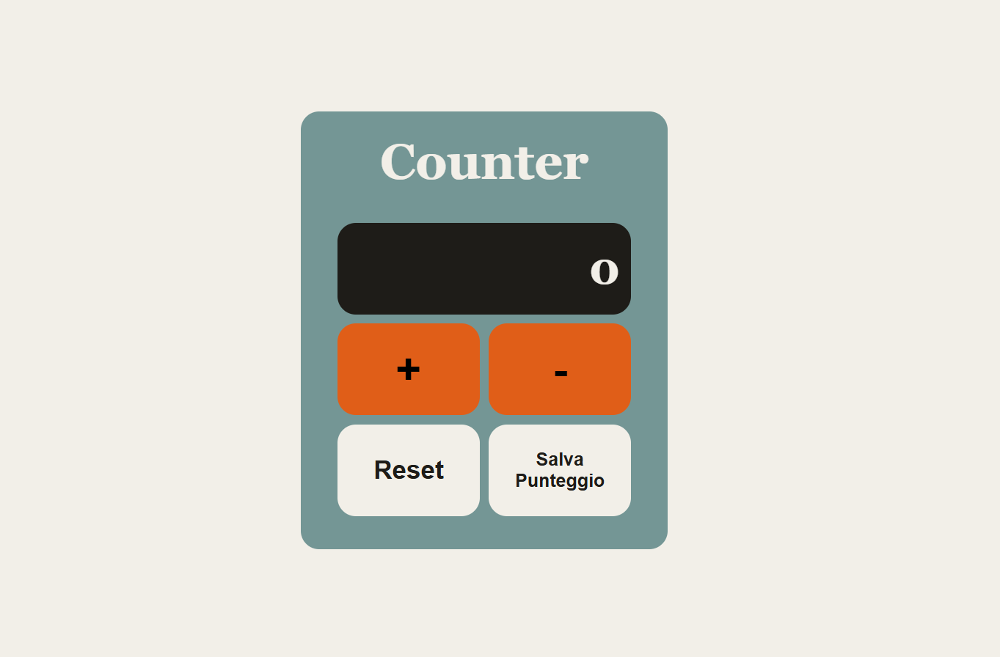
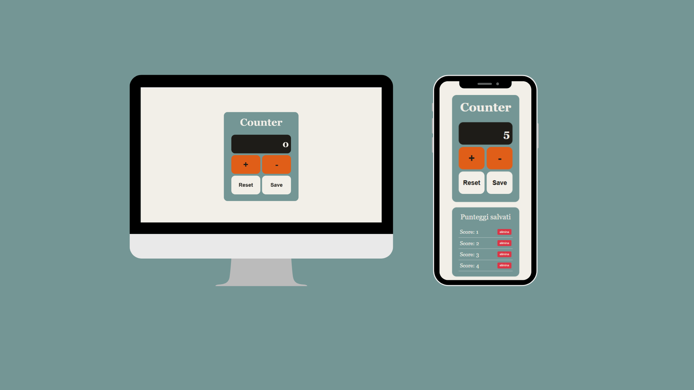

# Project: Counter in JS e CSS

## Scopri il progetto:
### Come funziona il Counter?

Il progetto è un counter che puó essere incrementato e decrementato attraverso gli appositi pulsanti "+" e "-", con alcuni vincoli:
<ul>
  <li>il counter raggiunge un massiomo di 1.000.000. Se l'utente prova ad incrementare ulteriormente il counter un alert lo avvisa dell'impossibilità di farlo.</li>
  <li>il counter non assume valori negativi. Il valore di default è 0 e se l'utente prova a decrementarlo un alert lo avvisa dell'impossibilità di farlo.</li>
</ul>

Ho aggiunto 2 funzionalità oltre all'incremento:
<ul>
  <li>Reset: consente di riportare il counter a 0</li>
  <li>Salva Punteggio: consente di salvare fino a 5 score, eliminabili all'occorrenza con apposito pulsante</li>
</ul>

### Linguaggi usati:

 

 
  Come da richiesta del progetto per la creazione degli elementi non ho utilizzato HTML, ma ho manipolato il DOM attraverso Javascript

### Design Responsive

### Link Utili
<a href="https://git-ste.github.io/counter/">Link diretto alla pagina web del counter </a>
